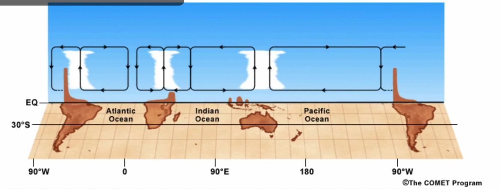

## El Nino and Southen Oscillation

### Tropospheric general circulation(대류권 일반순환)
- ITCZ(적도 저기압대): 뜨거움, 강한 상승기류, 많은 비
- 극고기압대: 찬공기 하강
- 무역풍(적도-30, 동>서), 편서풍(30-60, 서>동), 극동풍(극-60, 동>서)
- Jet stream: 1) Subpolar JS: 대략 60도 위도 셩성, 강한 서에서 동으로 부는 바람. 2) Subtropical JS: 대략 30도 위도 형성, 극제트보다 조금 남쪽 위치.
- 순환셀: 해들리셀, 페렐셀, 극셀

### The tropical atmosphere
- *Coriolis force is very small near the equator, 따라서 Geostrophic balance가 성립하지 않음. 따라서 *baroclinic instability와 전선활동이 거의 없다.

- 열대지역은 중위도나 극지방에서는 발견되지 않는 특이한 파동과 교란현상이 특징이다. e.g. *Equatorial Rossby waves and Equatorial Kelvin waves.

- Walker circulation: is an equatorial curculation driven by temperature differences over land and the ocean. 
원리: 열대태평양의 동쪽해역(남아메리카 근처)는 차가운 해류로 차갑고, 서쪽해역(인도네시아)는 따뜻한 해류로 온도가 높다. 동서간 온도차이 발생으로 대규모 대기순환 유발.

워커 순환이 약화되면 동태평양 해수면 온도 상승 > 강한 상승기류 발생 : 엘니뇨 
워커 순환이 강화되면 동태평양 해수면 온도 하강 > 서태평양에서 강한 상승기류 발생: 라니냐

- 워커순환과 해들리 순환 차이: 워커순환은 적도를 따라 동서방향(zonal)로 흐르고, 해들리 순환은 남북방향(meridional)로 움직인다. 

> NOTE: 
> 1) <strong>코리올리힘이 작다는것</strong>: 적도에서는 지구회전속도가 상대적으로 느리므로. 
> 2) <strong>Baroclinic instability:</strong> 태양복사열이 불균질하게 가열되면 기온의 경도차가 발생. 이런 경도차에 의앻 야기되는 위치에너지는 운동에너지의 변환을 야기하고, 대기중 운동에너지 증감은 기층의 불안정 초래. 이게 남북방향일때가 Baroc. Ins.
> 3) <strong>적도로스비파</strong>: 코리올리힘에 의해 발생하는 파동으로 적도부근에서 발생하며 서쪽으로 이동. 비교적 느리고, 엘니뇨와 같은 현상과 관련이 있을 수 있다. 
> 4) <strong>적도켈빈파</strong>: 주로 동쪽으로 이동. 로스비파보다 파장이 짧을 수 있으며 수백에서 수천 킬로미터. 로스비파보다 빠르다. 적도를 중심으로 대칭적이며 코리올리힘의 영향을 덜 받는다. 엘니뇨와 관련. 해양내 온도와 염분분포를 조절해 대규모 해양순환에 영향.
> 5) 해들리 순환은 열대와 중위도 사이의 에너지, 수분, 운동량 교환을 설명.
